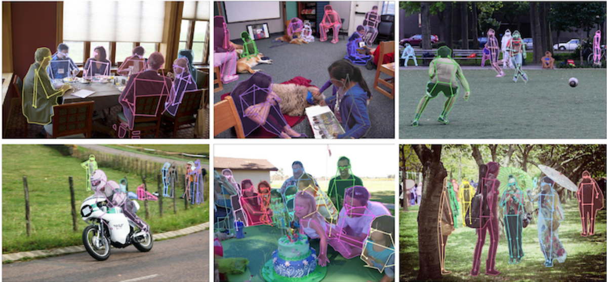
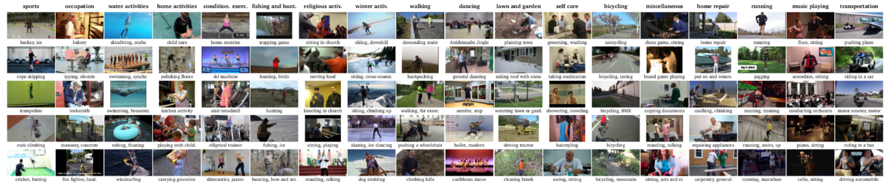
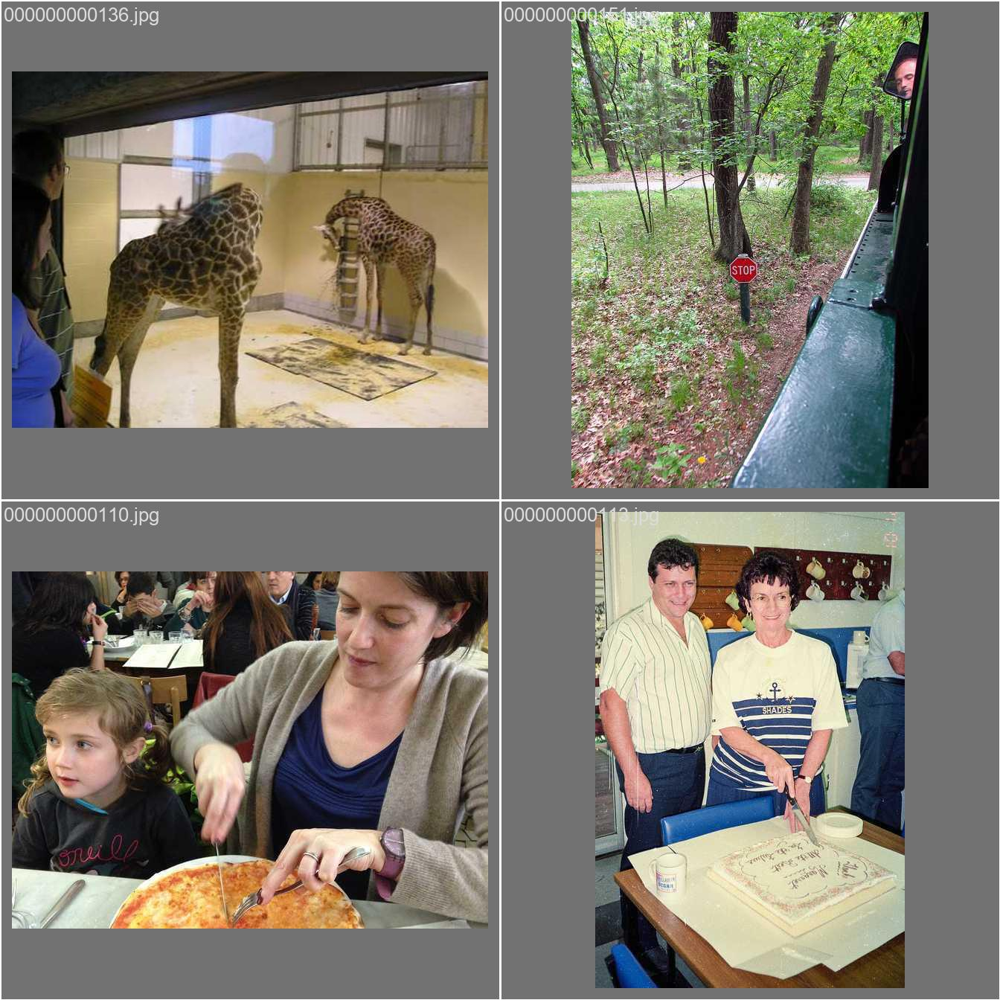
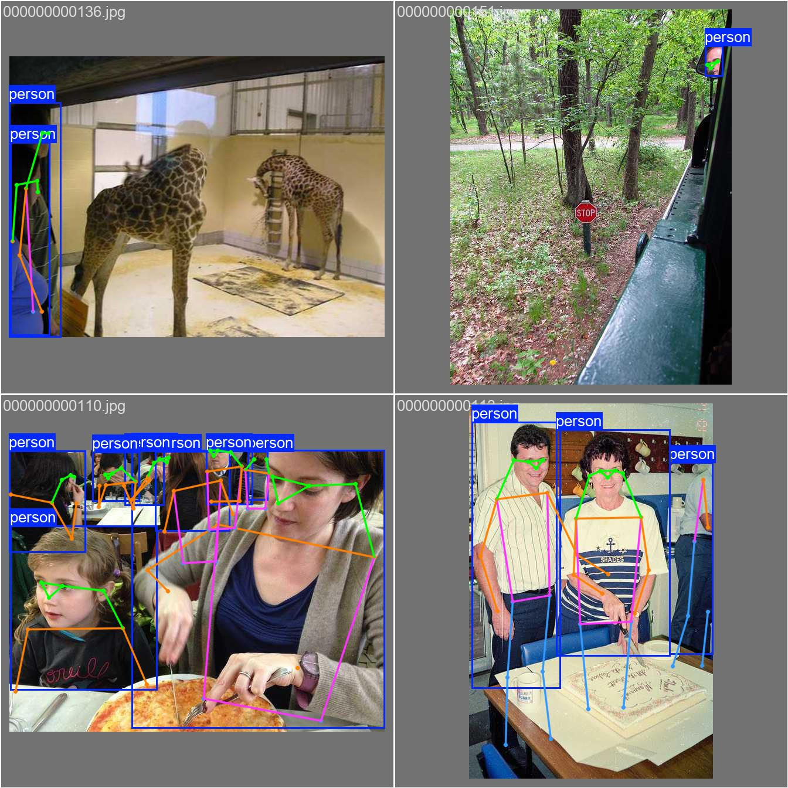
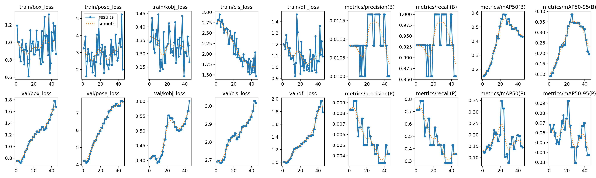

# 基于Yolo和LLM实现运动员动作分析

### - 动作检测：[Yolo v11-pose](https://docs.ultralytics.com/zh/tasks/pose/)、[MediaPipe](https://github.com/google-ai-edge/mediapipe)

### - 语言模型：LLM（DeepSeek/Qwen/Chat-GPT/……）

### - 用户界面：Web -（JAVA/Springboot/Vue/……）

### - 数据：COCO-Pose 数据集、MPII Human Pose
[COCO-Pose](https://cocodataset.org/#keypoints-2017) 数据集是 COCO（Common Objects in Context）数据集的专门版本，专为姿势估计任务而设计。它利用 COCO Keypoints 2017 图像和标签来支持训练 YOLO 等模型以进行姿势估计任务。

**训练：56599 张    验证：2346张**

[MPII Human Pose](https://human-pose.mpi-inf.mpg.de/)**（25000张）**

### 训练
    Model：yolo11n-pose dataset：COCO8-pose imgsz：640  epochs：45
